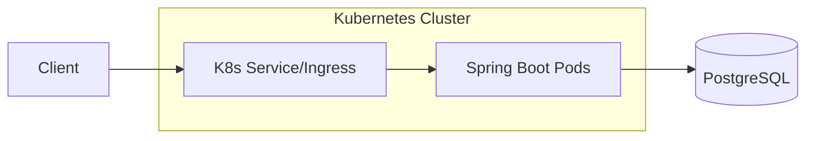

# ☁️ CloudTasker API

[](https://github.com/renekemalandua/cloud-tasker)
[](https://kubernetes.io/)
[](https://spring.io/projects/spring-boot)

CloudTasker é uma API RESTful de nível industrial para gerenciamento de tarefas, projetada com foco em **escalabilidade, observabilidade e portabilidade**. Não é apenas um CRUD; é uma demonstração de arquitetura robusta integrando Java moderno com ecossistema Cloud Native.

---

## 🏗️ Stack Tecnológica & Arquitetura

O projeto foi concebido sob a filosofia de **Infrastructure as Code (IaC)** e **Container-First**.

### Backend & Data
- **Java 17 & Spring Boot 3**: Núcleo de alta performance e produtividade.
- **Spring Data JPA / Hibernate**: Camada de persistência resiliente.
- **PostgreSQL**: Engine de banco de dados relacional robusto.

### DevOps & Cloud Native
- **Docker & Docker Compose**: Padronização de ambiente de desenvolvimento.
- **Kubernetes (K8s)**: Orquestração completa com `HPA`, `Deployment`, `Service` e gestão de segredos.
- **GitHub Actions**: Pipeline de CI/CD automatizado (Build -> Test -> Image -> Push).
- **OpenAPI / Swagger**: Documentação viva e interativa.

### Fluxo de Requisição


---

## 📂 Estrutura de Ativos (Project Blueprint)

```text
.
├── .github/workflows/      # Pipelines de CI/CD (GitHub Actions)
├── k8s/                    # Manifestos de Orquestração (Deployment, HPA, ConfigMaps)
├── src/                    # Código fonte (Clean Architecture principles)
├── Dockerfile              # Definição de imagem imutável
├── docker-compose.yml      # Orquestração local para DEV
└── pom.xml                 # Gestão de dependências e Build
```

---

## 🚀 Quick Start (Local Development)

### Pré-requisitos
- Docker & Docker Compose instalados.

### Execução
Basta um único comando para subir toda a stack (API + Database):

```bash
docker compose up --build -d
```

Acesse a aplicação em:
- **API Base**: `http://localhost:8080`
- **Swagger UI**: `http://localhost:8080/swagger-ui/index.html`

---

## ☸️ Operação em Kubernetes

A aplicação já vem "batizada" para rodar em clusters produtivos.

### Deploy dos Manifestos
```bash
kubectl apply -f k8s/
```

### Principais Recursos Ativos:
- **Horizontal Pod Autoscaler (HPA)**: Escalonamento automático baseado em CPU/Memória.
- **Liveness & Readiness Probes**: Garantia de que o tráfego só chega a instâncias saudáveis.
- **ConfigMaps & Secrets**: Separação total entre código e configuração.

---

## ⚙️ Pipelines de Entrega Contínua (CI/CD)

Nosso workflow no GitHub Actions garante a integridade de cada entrega:
1. **Build & Test**: Execução de testes unitários e build Maven.
2. **Containerization**: Criação da imagem Docker otimizada.
3. **Registry Push**: Upload para o Docker Hub/GHCR.
4. **Deploy Validation**: (Opcional) Trigger para atualização do cluster.

---

## 📊 API Spec (Endpoints Principais)

| Método | Endpoint | Função |
| :--- | :--- | :--- |
| `POST` | `/tasks` | Persistência de nova tarefa |
| `GET` | `/tasks` | Recuperação paginada de tarefas |
| `PUT` | `/tasks/{id}` | Atualização de estado/conteúdo |
| `DELETE` | `/tasks/{id}` | Remoção física da tarefa |

---

## 🎯 Visão Estratégica
Este projeto não é um exercício de código, é um modelo de **Plataforma**. O foco é reduzir o *time-to-market* garantindo que a infraestrutura seja tão sólida quanto o código de negócio.

---
*Mantido por **Rene Kemalandua** - Foco em Engenharia de Software e DevOps.*
